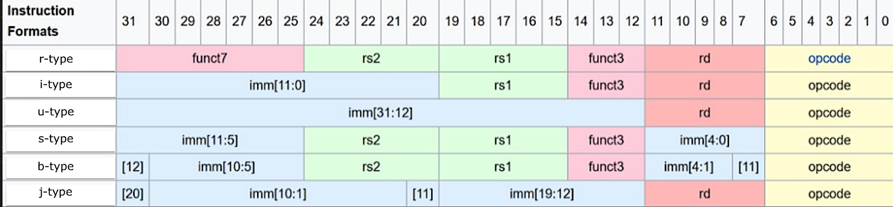

# RISC-V RV32I Processor Coursework
___

Personal Statement of Contribution

Name: Wenjie Mei

___

## Content
* Introduction: Developing the single cycle RISC-V processor
* Module: ALUDecode.sv
* Module: ALU.sv
* Module: ControlUnit.sv, and related selection modules: 
    * MUX_ALUsrc.sv
    * MUX_Resultsrc.sv
    * MUX_PCsrc.sv
* Module: Data Memory.sv
* Module: Extension.sv
* Module: InstructionMemory.sv
* Module: RegisterFile.sv
* Other Modules:
   * PcRegister.sv
   * PcIncrement4.sv
   * Add_pc_imm.sv
* Main.sv, the top module
* Extra testbench: All_basis_instruction_test

<br><br>

___

## Introduction
Developing the single cycle RISC-V processor
___

I am the group member who mainly worked on writing the single cycle processor part of the project, debugging and shortening / merging the modules without affecting their original functions. 

The single cycle RISC-V processor is able to read and execute the machine code of all basic RV32I instructions except ecall and ebreak, so my commit includes writing control unit, muxes and ALU that fits in a wide range of instructions. Also, instructions like jalr, auipc and branch instructions also increase the complexity of datapath, which is different from the processor model illustrated in course ppt. My commit implements these differences to the modules and the ways to connect them.

I also write a testbench that tests almost all the instructions on this processor. This is merely used by myself to determine whether there is a bug among the modules

<br><br>

___

## Module: ALU Decode
The input logics of ALUdecode and the way to decode them are listed below:
___

ALUop indicates whether to use func3 and flags: 
* For load, s-type, j-type instructions, ALUop = 0, ALUctrl = 0, ALU simply adds 2 operand
* For u-type instruction, ALUop = 3, ALUctrl = 1, ALU simply equates the output to N2 (IMM), since no registers are involved.
* For most i-type and r-type instructions, we look at func3 but not flag value (except slt and sltu). ALUop = 2
* For b-type instructions, we look at both func3 and flag values.

func3 determined what type of operation that is going to conduct, so according to the instruction list, I implement cases of {op, func3} and it set ALUctrl[3:0],
which is the output linked to ALU to match each instructions to specific calculations. 

The following tables shows instructions, ALUop, func3 and ALUctrl values:

instruction name | ALUop | func3 | ALUctrl | Additional note
--- | --- | --- | --- | ---
add / addi | 10 | 000 | 0000 |
any else | 00 | x | 0000 | simply add 
lui | 11 | x | 0001 | simply take IMM
and / andi | 10 | 111 | 0010 
or / ori | 10 | 110 | 0011
xor / xori | 10 | 100 | 0100
sll / slli | 10 | 001 | 0101 
srl / srli | 10 | 101 | 0110 | func7[5] = 0
sra / srai | 10 | 101 | 0111 | func7[5] = 1
beq | 01 | 000 | 1000
bne | 01 | 001 | 1001
sub | 10 | 000 | 1010 | func7[5] = 1, op5 = 1
blt | 01 | 100 | 1100
slt / slti | 10 | 010 | 1100 | same as blt
bltu | 01 | 110 | 1110
sltu / sltui | 10 | 011 | 1110 | same as bltu
bge | 01 | 101 | 1101
bgeu | 01 | 111 | 1111

Generally, I use ALUctrl[3] to determine whether this is a flag operation, though there are some special ALUctrl values:
* For sub, ALUctrl is 0b1010, this is because sub is used to determine the values of the flags. 
* The ALUctrl of slt is exactly same as blt, and ALUctrl of sltu is exactly same as bltu. This is because they can be seen as the same operation.
The difference is that slt/sltu write whether N1 < N2 to regfile, while their flag results are considered invalid in control unit (see Control Unit)

Additionally, operation pair (add, sub), pair (srl, srla), pair (srli and srai) are distinguised by func7[5] (func75); 
since there is no subi, which is exactly the same as addi, Opcode[5] (op5) is used to indicate whether IMM is used.
Therefore, I add extra case statements considering func75 and op5 to change ALUctrl.

<br><br>

___

## Module: ALU
___
According to ALUctrl, I match the calculation logics to instructions:

```
    casez (ALUctrl) // using casez to use ? sign to reduce the length of code.

        4'b1???: {flagC, DOutAlu} = {1'b0, N1} + {1'b0, ~N2+1}; // sub, flag operation and slt / sltu 
        4'b0000: DOutAlu = N1 + N2; // add, load, save, ... 
        4'b0001: DOutAlu = N2; // lui
        4'b0010: DOutAlu = N1 & N2; // and
        4'b0011: DOutAlu = N1 | N2; // or
        4'b0100: DOutAlu = N1 ^ N2; // xor
        4'b0101: DOutAlu = N1 << N2[4:0];  // sll
        4'b0110: DOutAlu = N1 >> N2[4:0];  // srl
        4'b0111: DOutAlu = $signed(N1) >>> N2[4:0];  // sra
    endcase
```

Note that the maximum value shifted is 31, so we only need to take 5 bits from N2

For flag operations, I use flagZ (output == zero), flagS (output[31]), flagC (carry) and flagV(overflow)
* To implement flagC, I change the subtraction logic so that it first implement 2's complement to N2, add an extra bit to the top and add them together, so the length of output is 33 bit. (The other way is to add an extra bit equal to their first bit)
* To implement flagV, I list case of overflow: if N1 and -N2 are all positive but N1-N2 is negative, or if N1 and -N2 are all negative but N1-N2 is positive, overflow happens.

After getting the four flags, I can implement flag operations: 
```
    case (ALUctrl)

        4'b1000: flag = flagZ; // beq
        4'b1001: flag = ~flagZ; // bne
        4'b1100: flag = (flagS != flagV); // blt, slt
        4'b1101: flag = (flagS == flagV); // bge
        4'b1110: flag = ~flagC; // bltu, sltu
        4'b1111: flag = flagC; // bgeu
        default flag = 1'b0;
    endcase
```
Finally, the output of slt, slti, sltu and sltui should be {31'b0, flag}, we do not care about the alu output of branch instructions

<br><br>

___

## Module: Control Unit
main control unit base on Instruction [6:0]
___


the input of Control Unit includes Opcode, which is the last 7 bits of the instuction that determines the type of instructions
They are separated as follows:

Opcode | Instruction Type | Structural Instuction Type | Datapath Action / Explanations
--- | --- | --- | ---
0010011 | common i-type instructions | i-type | regfile and IMM arithmetic instruction 
0011011 | common i-type instructions | i-type | (Not on instruction list but generated from online assembler)
0110011 | r-type instructions | r-type | regfile only arithmetic instuction
0110111 | lui | u-type | write IMM20 to regfile
1100011 | branch instructions | b-type | shifting PC if flag result == 1
0100011 | store instructions | s-type | store regfile value to data memory
0000011 | load instructions | i-type | load data memory content to regfile
1101111 | jal | j-type | write pc+4 to regfile and then shifting pc
1100111 | jalr | i-type | write pc+4 to regfile and add regfile and IMM to pc
0010111 | auipc | u-type |  add IMM20 to pc and write in regfile

And the following diagram shows how each type of instructions are structured:



Except from the 6 basic instructions types, there are instructions like load, jalr and auipc which share the traits of different instruction types. This is the reason why I need to list them separately in the following case statements

___ 


The output IMMctrl is connected to the Extension unit which extract IMM from instruction based on its type (see Extension)

```
    case (Opcode)
        7'b0010011: IMMctrl = 3'b000; // i-type
        7'b0011011: IMMctrl = 3'b000;
        7'b0000011: IMMctrl = 3'b000; // load
        7'b1100111: IMMctrl = 3'b000; // jalr

        7'b0100011: IMMctrl = 3'b001; // s-type

        7'b1100011: IMMctrl = 3'b010; // b-type

        7'b0110111: IMMctrl = 3'b011; // u-type
        7'b0010111: IMMctrl = 3'b011; // auipc
        
        7'b1101111: IMMctrl = 3'b100; // j-type

        default: IMMctrl = 3'b000;
    endcase
```

___

The output ALUop is connected to the ALU Decoder to generate ALUctrl (see ALUDecode) 
* Jalr here is regarded as j-type instruction but not i-type

```
    case (Opcode)
        // Add 2 operands
        7'b0100011: ALUop = 2'b00; // s-type
        7'b0000011: ALUop = 2'b00; // load
        7'b1101111: ALUop = 2'b00; // j-type
        7'b1100111: ALUop = 2'b00; // jalr

        // using func3 and flags
        7'b1100011: ALUop = 2'b01; // b-type

        // using func3 (some use flag)
        7'b0010011: ALUop = 2'b10; // i-type
        7'b0011011: ALUop = 2'b10;
        7'b0110011: ALUop = 2'b10; // r-type

        // only pass IMM to ALU
        7'b0110111: ALUop = 2'b11; // u-type
        7'b0010111: ALUop = 2'b11; // auipc
        default: ALUop = 2'b00;
    endcase
```

___

The output Regwrite determines whether to write on regfile (see RegisterFile): 

```
    case (Opcode)
        7'b0110011: RegWrite = 1'b1; // r-type
        7'b0010011: RegWrite = 1'b1; // i-type
        7'b0011011: RegWrite = 1'b1; 
        7'b0000011: RegWrite = 1'b1; // load
        7'b0110111: RegWrite = 1'b1; // u-type
        7'b0010111: RegWrite = 1'b1; // auipc
        7'b1100111: RegWrite = 1'b1; // jalr
        7'b1101111: RegWrite = 1'b1; // j-type
        default: RegWrite = 1'b0;
    endcase
```

___

The output DMwrite determines whether to write on data memory (see DataMemory): 

```
    case (Opcode)
        7'b0100011: DMwrite = 1'b1; // s-type
        default: DMwrite = 1'b0;
    endcase
```

___

The output ALUsrc determines whether the second operand is from regfile or Extension, this controls a mux that select from DOutReg and IMM: 

```
    case (Opcode)
        7'b0100011: ALUsrc = 1'b1; // s-type
        7'b0010011: ALUsrc = 1'b1; // i-type
        7'b0011011: ALUsrc = 1'b1;
        7'b0000011: ALUsrc = 1'b1; // load
        7'b1100111: ALUsrc = 1'b1; // jalr
        7'b0110111: ALUsrc = 1'b1; // u-type
        default: ALUsrc = 1'b0;
    endcase
```

___

The output Resultsrc determines how to write on the regfile:

```
    case (Opcode)
        7'b0000011: ResultSrc = 2'b01; // load
        7'b1101111: ResultSrc = 2'b10; // j-type
        7'b0010111: ResultSrc = 2'b11; // auipc
        default: ResultSrc = 2'b00; 
    endcase
```

And this is the implementation of Resultsrc MUX:

```
   case (ResultSrc)
        2'b00: DInReg = DOutAlu;
        2'b01: DInReg = DOutDM;
        2'b10: DInReg = PCadd4;
        2'b11: DInReg = PCaddIMM;
    endcase
```
___

The output PCsrc determines how to shift the pc.
* Also, whether b-type instruction shift depends on the flag value, so me need to combine the flag

```
    case ({Opcode, flag})
        8'b11011111: PCsrc = 2'b01; // j-type anyway
        8'b11011110: PCsrc = 2'b01;
        8'b00101111: PCsrc = 2'b01; // auipc anyway
        8'b00101110: PCsrc = 2'b01;
        8'b11000111: PCsrc = 2'b01; // b-type if flag == 1
        8'b11001111: PCsrc = 2'b10; // jalr anyway
        8'b11001110: PCsrc = 2'b10;
        default: PCsrc = 2'b00; // b-type if flag == 0 and any instructions else
    endcase
```

And this is the implementation of PCsrc MUX:

```
    case (PCsrc)
        2'b00: PCN = PCadd4; // common
        2'b01: PCN = PCaddIMM; // jal, auipc, branch
        2'b10: PCN = DOutAlu; // jalr, we need to access the regfile output and add so connecting alu
        2'b11: PCN = PCadd4; // nothing here
    endcase
```

<br><br>

___

## Module: Data Memory
___

A typical data memory have address input (AdIn), data input (DInDM), data write enabler (DMwrite), data output (DOutDM) and clock signal. 
Additionally, func3 is also introduced because there are different read and write instructions:

instruction name | func3 | implement code
--- | --- | --- 
lw | 010 | DOutDM = {RamArray[Ad+3], RamArray[Ad+2], RamArray[Ad+1], RamArray[Ad]};
lh | 001 | DOutDM = {{16{RamArray[Ad+1][WB-1]}},RamArray[Ad+1], RamArray[Ad]};
lb | 000 | DOutDM = {{24{RamArray[Ad][WB-1]}},RamArray[Ad]};
lhu | 101 | DOutDM = {{16'b0},RamArray[Ad+1], RamArray[Ad]};
lbu | 100 | DOutDM = {{24'b0},RamArray[Ad]};
sw | 010 | {RamArray[Ad+3], RamArray[Ad+2], RamArray[Ad+1], RamArray[Ad]} <= DInDM;
sh | 001 | {RamArray[Ad+1], RamArray[Ad]} <= DInDM[15:0];
sb | 000 | RamArray[Ad] <= DInDM[7:0];

As above, in RISC-V architecture, memory is stored in bytes. 
* For storing word, the direction is such that the address byte stores word[7:0], the address+1 byte stores word[15:8]... and so on
* This means reading bit should start from address+n loaded as output[7+8n:8n] ... to address+0 loaded output[7:0]

<br><br>

___

## Module: Extension
___

according to the type of instructions: (r-type does not use IMM)


We use case to implement the Extension unit:


```
    case(IMMctrl)
        3'b000: IMM = {{20{instr[W-1]}}, instr[W-1:W-12]}; // i-type
        3'b001: IMM = {{20{instr[W-1]}}, instr[W-1:W-7], instr[W-21:W-25]}; // s-type
        3'b010: IMM = {{19{instr[W-1]}}, instr[W-1], instr[W-25], instr[W-2:W-7], instr[W-21:W-24], 1'b0}; // b-type
        3'b011: IMM = {instr[W-1:W-20], 12'b0}; // u-type
        3'b100: IMM = {{11{instr[W-1]}}, instr[W-1], instr[W-13:W-20], instr[W-12], instr[W-2:W-11], 1'b0}; // j-type
        default: IMM = {{20{instr[W-1]}}, instr[W-1:W-12]}; // i-type
    endcase
```

<br><br>

___

## Module: Instruction Memory
A typical asychronous RISC-V architecture Instruction Memory
___

* I added another logic (AInIM) which is PC[Memory_size - 1, 0], because this memory does not have not as large as 2*32 space (I set it to only 16 here and can be adjusted to maximum 32 in top module)
* since data is stored in bytes, the output is connecting 4 consecutive bytes
  
```
   assign instr = {RomArray[AInIM+3], RomArray[AInIM+2], RomArray[AInIM+1], RomArray[AInIM]};
```

* input: Address (PC)
* output: Instruction (instr)

<br><br>

___

## Module: Register File
A typical register file
___

I followed the design of Regfile in Lab4

<br><br>


___

## Other Module

___

PC Register

* input: PCN
* output: PC
* Simple register that stores the PC value

___

PC Increment 4

* input: PC
* output: PCN
* Simply adding next PC values by 4

___

Add_PC_IMM

* input: PC, IMM
* output: PCaddIMM
* Simply adding PC and IMM and output

<br><br>

___

## Main.sv
the top module
___

This module allocates all the modules together.

There are wide range of variables. I have modified the variables of each component so that the input / output that are supposed to be connected share the same name.

The only differences in input / output name happens when I assign the instructions to different inputs this includes:
* Opcode = instr[6:0]
* func75 = instr[5]
* AdInReg = instr[11:7]
* func3 = instr[14:12]
* AdOutReg1 = instr[19:15]
* AdOutReg2 = instr[24:20]
* func75 = instr[31]

<br><br>

___

## Extra Testbench
___

see All_basic_instruction_test.s

<br><br><br><br><br><br><br><br><br><br>
