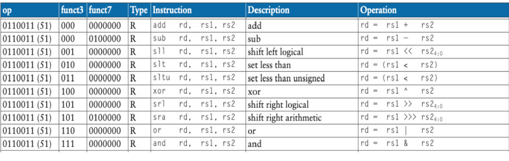
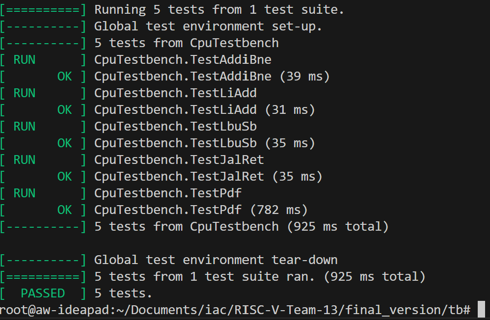

# Contents
- 1 Creating ALU, ALUDecode, Control Unit
	1. ALU
	2. ALUDecode
	3. Control Unit
- 2 Unit Tests on modules for single-cycle RISC-V RV32I Processor
	1. Sign Extend Unit test (complete)
	2. Register File Unit test (complete)
	3. ALU Unit test (complete)
	4. Control Module Unit test (complete)
	5. ALUDecode Unit test (complete)
	6. Data Memory Unit test (complete)
- 3 Debugging Single Cycle Modules
	1. ALU
	2. Data Memory + Instruction Memory
	3. WriteBack Mux
- 4 Testing given assembly programs
	1. Programs 1-3, Addi, BNE, LBU, SB
	2. Program 4  - JAL/JALR
	3. PDF testing
	4. verifying PDF on Vbuddy
- 5 Debugging Pipelined Processor
- 6  Conclusion and Reflections
	1. Possible Improvements
	2. Concluding Statement

Things to complete single cycle:
	test all with given programs

# 1 Creating Single Cycle Modules

## 1.1 ALU Module

The ALU Module is required to handle all arithmetic related operations in the ALU, it is used for the R-type, I-type, Branching instructions. 

Another teammate had created a design for the ALU however, this had some design quirks which made it harder to work with in the top/other modules and also wasn't working as well so therefore I decided to change it.



A table showing the functionality of the ALU, I used this as a platform for the final design


# 2. Unit Tests
Unit Tests are a key part of the testing and verification processes, having created Unit Tests for almost every module, it has allowed me to gain a deeper understanding of each of the individual components in the RISC-V processor. Industry standard testbenches were created using G-Test and considering various edge cases and inputs.

### 2.1 Sign Extend Unit Test
The Sign Extend Unit had 5 methods of extension, namely I, S, B, U, J types, examples were hand calculated to verify the correct immediate was being produced.

This is a short snapshot of code (for illustrative purposes - not identical to actual code.) of how the extension module was implemented by another teammate:
```systemverilog
	case(IMMsrc)
    3'b000: out[W-1:0] = {{20{sign}}, instr[W-1:W-12]}; // I-type
```

Below is a snippet of code used to test the default case:

```c++
TEST_F(SignExtensionTest, Default){

    dut->instr = 0x12345678;

    dut->IMMsrc = 0b111; //invalid immsrc

    evaluate();

    EXPECT_EQ(dut->out, 0x12345678); //defaults to just returning instr

}
```

A value of instr is passed in and an invalid IMMsrc code (not specified by the code explicitly) is provided. The testbench checks that the output value is identical to the original instruction. 

An image is shown below verifying that each of the 6 testcases passed, indicating that the intended logic was outputted correctly.


### 2.2 Register File Unit Test

The Register File consists of 1 Write port and simultaneous dual-port read per clock cycle, testing this would need to check that written data was written to the correct address

```C++
 TEST_F(reg32Test, WriteAndReadAnotherRegister) {

     dut->write_addr = 2;         // Write to register 2

     dut->WD3 = 0x12345678; // Data to write

    dut->WE3 = 1;     // Enable write

    evaluate();

    clockTick();

    dut->WE3 = 0;     // Disable write

    dut->A2 = 2;       // Read from register 2

    evaluate();

    clockTick();

    EXPECT_EQ(dut->DOut2, 0x12345678);

}
```

The above code indicates writing the data 0x12345678 to register 2, As the Register File is a clocked component, an additional clockTick signal was devised in order to update the data inside the component, the output Dout2 is expected to receive the data from WD3.

Another important consideration is that the register 0 is a special register which must not be overwritten, there was a separate test devised for this as it is a critical part of the RISC-V architecture functioning correctly.

Below there is code showing the test for ensuring this contraint is respected.

```C++
TEST_F(reg32Test, WriteToRegister0ShouldNotChange) {

    dut->write_addr = 0;         // write to register 0

    dut->WD3 = 0x12345678; // Data

    dut->WE3 = 1;     // eable write

    evaluate();

    clockTick();

    dut->WE3 = 0;     // Disable write

    dut->A1 = 0;       // Read from register 0

    evaluate();

    clockTick();

    EXPECT_EQ(dut->DOut1, 0); // reg 0 should always return 0

}
```

The Register File module successfully passed all 6 testcases that were devised indicating it would function as intended

### 2.3 ALU Unit Test

The ALU is a key part of the RISC-V, it's implementation was discussed in Section 1.1 - ALU. 

The ALU was Unit Tested by keeping in mind the inputs of ALUCtrl and monitoring the output accordingly. 

For example, the XOR instruction was tested by the following unit test: 

```C++
TEST_F(ALUTest, XorInstr) {

    dut->ALUctrl = 0b0100;  // XOR

    dut->SrcA = 0x00000F0F;

    dut->SrcB = 0x00000FF0;

    evaluate();

    EXPECT_EQ(dut->ALUresult, 0x000000FF);  // Expect 0xFF

}
```
The testcase fully tests the behaviour of the XOR operation, and the ALU successfully passed all testcases.

## 2.4 Control Module Unit Test

The Control Unit is perhaps the most influential module within the RISC-V, as it determines each control signal through the datapath, the implementation for this module was discussed in Section 1.3

Many tests were devised to test the functionality of the Control Unit, due to there being many different outputs, this testbench was fairly lengthy, spanning 250 lines of code.

The most important test was for the default case, which determines the outputs of the control unit in case of an invalid instruction. 

```C++
TEST_F(ControlUnitTest, DefaultTest) {

    dut->opcode = 0b1111111;  // invalid opcode

    dut->funct3 = 0b110; //random funct3 - shouldnt affect anything

    evaluate();

    EXPECT_EQ(dut->ALUop, 0b000);  // Expect default for all (0)

    EXPECT_EQ(dut->ALUSrc, 0b0);

    EXPECT_EQ(dut->ResultSrc, 0b00);

    EXPECT_EQ(dut->ImmSrc, 0b00);

    EXPECT_EQ(dut->RegWrite, 0b0);
    
    EXPECT_EQ(dut->MemWrite, 0b0);
    
    EXPECT_EQ(dut->PCSrc, 0b0);


}
```

In case of an invalid instruction, all the outputs are set to 0 ensuring no unexpected operations occur within the processor.

The Control Unit ended up passing all 31 testcases that were designed for it, indicating it was handling logic flow correctly.

## 2.5 ALUDecode Unit Test

The implementation of the ALUDecode module was discussed in Section 1.2. 

Tests for ALUDecode were relatively simple, just ensuring the input of ALUop (defined in Control Unit) and funct3 were correctly mapping to the respective outputs (ALUCtrl signal)

## 2.6 Data Memory Unit Test

In this module, I learnt the limitations of Unit Testing, whilst it is a good way of checking if the expected output matches the actual output for a given input, it may not actually check if the logic implemented is fully accurate for it's purpose!

The original Data Memory did not use Little-endian indexing, at the time of writing the unit tests. I was unaware of this as I hadn't implemented this module initially, therefore the Unit Test written worked for this incorrect `DataMemory.sv` file, but the module wasn't fit for use in the RISC-V - I figured this out later whilst debugging the other modules, which is discussed further in Section 3.

# 3 Debugging Single Cycle Modules

Debugging is an integral part of the design process, and can also be one of the most frustrating too!

Initially, my terminal was filled with over 100 error messages, warnings, undefined behaviour alongside a whole host of other issues. This can seem very daunting and difficult to deal with but I decided to take a systematic approach to tackle it head on.

Errors such as unused signal indicated that the code had some unnecessary clutter with extraneous logic, this seemed relatively easy to debug as it mainly involved removing lines of code.

Errors such as syntax errors were another challenge, which mostly arose from minor oversights from myself and other teammates whilst writing SystemVerilog code. 

A benefit of Unit Testing also quickly became apparent here, every module which I had Unit Tested did not have any syntax errors. These were dealt with beforehand during Unit Testing - once again impressing upon me the importance of testing.

## 3.1 Modifying ALU

Originally, the ALU had been created by using 3 flags to indicate whether a branching condition was met, namely `NegativeFlag`, `ZeroFlag` and `UnsignedLess`. Whilst this was functional, I felt that this implementation could be optimised slightly further.

My solution involved removing the flags. For branch instructions, they would either return 0 or 1 to the 'branch' output based on the  evaluation of the  srcA and srcB inputs and condition. 

```SystemVerilog
  output logic branch

    /*output logic ZeroFlag,

    output logic NegativeFlag,

    output logic UnsignedLess

    */
```
```SystemVerilog
			4'b1010: branch = (SrcA == SrcB) ? 1 : 0; //beq

            4'b1011: branch = (SrcA != SrcB) ? 1 : 0; //bne

            4'b1100: branch = (SrcA < SrcB) ? 1 : 0; //blt

            4'b1101: branch = (SrcA >= SrcB) ? 1: 0; //bge

            4'b1110: branch = ($unsigned(SrcA) < $unsigned(SrcB)) ? 1 : 0; //bltu

            4'b1111: branch = ($unsigned(SrcA) >= $unsigned(SrcB)) ? 1 : 0; //bgeu
```

The 2 given snippets of code summarises the main changes made to the ALU.

The branch input would then be passed into the Control Unit and used to determine the value of the select input `PCSrc` to modify the `Program Counter`.

## 3.2 Modifying Data Memory + Instruction Memory

Whilst running the test programs - further discussed in Section 4 - I noticed that the instructions being outputted were incorrect and had invalid opcodes by checking the `waveform.vcd` files on the Gtkwave software.

The issue was arising from the addressing of the memory in both of these components, instead of little-endian, the type of addressing used was the opposite. Whilst the error was a simple one to fix, it highlighted the importance of having a full understanding of the RISC-V processor and helped me to review and correct mistakes made by others and even myself. 

```
3'b010: ReadData = {RamArray[AdM+3], RamArray[AdM+2], RamArray[AdM+1], RamArray[AdM]}; // lw
```

A snippet of code showing that the `Data Memory` now follows the little-endian format.

## 3.3 Writeback Mux

In the original implementation , the `WriteBack_Mux.sv` component had used only 1 bit for ResultSrc, after reviewing the RISC-V card and documentation, it became clear to me that this was incorrect and required 4 inputs instead of 2:

```SystemVerilog
    input logic [W-1:0] ALUResult,

    input logic [W-1:0] ReadData,

    input logic [W-1:0] PCadd4,                                

    input logic [W-1:0] PCaddIMM,
```

The 4 inputs should now handle a wide range of instructions, from regular ADD/ADDI to LUI, JAL, and auipc instructions. 

These modifications also required some minor adjustments to the `main_top` module and the `Control Unit`. 

# 4 Testing Given Assembly Programs

In the tb folder on the Project Brief repo, we were provided with 5 test programs, these served as a baseline goal for the RISC-V CPU to pass and served as a nice barometer for if the implementation was successful 

## 4.1 Testing Programs 1-3

Programs 1-3 were relatively simple programs which implemented register calculations and then tested for a given output with the `doit.sh` file which was provided by the Project Brief repository.

My main method of debugging was via the Gtkwave waveform viewer, this allowed me to efficiently check the status of registers , inputs , outputs at any given clock cycle. Combining this with the .dis files included in the testing repo, I was able to accurately tell which instruction was occurring at any given clock cycle, providing a powerful debugging tool.


The above image shows an example of how I used gtkwave to test if the Sign Extend module was operating as expected.

``` dis
Disassembly of section .text:

bfc00000 <main>:
bfc00000:	0ff00313          	li	t1,255     //bfc: shows clock cycle.
bfc00004:	00100513          	li	a0,1
```

An image showing a snapshot of the .dis file used to help debugging

The majority of the errors in the operation of these programs stemmed from slight errors/ misconceptions about the operation of certain instructions and the associated handling of these within the Control Unit.

The error in the Load instructions was found to be due to the main_top having incorrect wiring for the Regfile - `ALUResult` was being passed in as the `DIn` instead of `Result` which meant that load instructions would not function correctly as they needed the `Data Memory` result instead of `ALUresult`. The `Result` output was the output from the WriteBack Mux. 

## 4.2 Program 4 - JAL

After initially testing program 4, I decided to look over the implementation of the JAL and JALR instructions (RET was a pseudoinstruction for JALR). 

Another small error corrected was that `ImmSrc` was being set incorrectly to 0b011 in the Control Unit for JALR instructions - this was due to grouping together JAL and JALR by mistake, and since JALR is I-type the immediate needs to be extended differently for JALR compared to JAL.

This is when I noticed an interesting dilemma for how to implement JALR correctly:

Option 1 was to make use of the ALU, using an add instruction with its own ALUCtrl input calculating `rs1 + Imm` , selecting `ALUResult` from the `WriteBack Mux`  by setting `ResultSrc` and then taking the `ALUResult` input at the `PCSrc Mux` by setting `PCSrc` accordingly.

Option 2 was to insert another mux between the PCAddIMM module and the PC, this would then use `jalr` select logic to choose between either `rs1` or `PC` and feed PCTarget back into the PCSrc Mux, where it would be selected using `PCSrc = 1` and update the Program Counter accordingly. Meanwhile at the `WriteBack Mux`, `PC + 4` would be selected and fed into `Register File` `DIn` pin, allowing rd = pc + 4. 

```SystemVerilog
    if(jalr)

        PC_out = rs1;

    else

        PC_out = PC;
```

The core logic behind the JALR mux

```SystemVerilog 
always_comb

    case (ResultSrc)

        2'b00: Result = ALUResult;      //from ALU

        2'b01: Result = ReadData;       //from data mem

        2'b10: Result = PCadd4;         // jalr, jal

        2'b11: Result = PCaddIMM;       //for auipc/lui

        default Result = ALUResult;

    endcase
```

The WriteBack Mux for Option 2

```SystemVerilog
    always_comb begin

        case (PCSrc)

            1'b0: PCN = PCPlus4;

            1'b1: PCN = PCTarget;

            //2'b11: PCN = Result        

  

        default: PCN = PCPlus4;

    endcase

    end
```

The now simplified logic for the `PCSRC` mux.

The 2 options were both valid ways to perform the JALR instruction. However I then noticed an opportunity to simplify the overall design - `PCSrc` could be made into a 1 bit signal with Option 2, furthermore, using an ALU to calculate a simple addition was more computationally expensive than a simple mux + adder, and therefore I decided to choose option 2 for the JALR implementation. 

I felt that I had made the right choice, having considered the implications of each design fully and giving it deep thought.

## 4.3 PDF testing

The PDF program simulates the behaviour of a given distribution, this program was noticeably more complex than the other 4, as it included all of the commands tested by the first 4 programs. 

Debugging this program was also a lot harder than the others due to the increased complexity. 

Luckily, the error had actually turned out to be a rather small one in this scenario - in `Data Memory`, the data being read was data.hex instead of gaussian.mem - the correct file.



An image verifying that each of the 5 testcases passed

## 4.4 PDF testing on Vbuddy

Once the PDF program was working, the next verification step was to plot these results on the Vbuddy and checking if this worked correctly, the vbuddy library, config file and .sh file were all quite simple to make/ copy across from previous labs.

The testbench mostly followed the standard template from previous tasks:

```C++
if(top->a0 != 0){

        if(top->a0 % 1 == 0){

            vbdPlot(int (top->a0),0 , 255);

            vbdCycle(simcyc);

    }

    }
```

This was the main change, the value of a0 is plotted provided it is not 0, and the % can allow us to change the frequency at which a0 is plotted to reduce load on Vbuddy and ensure a more readable plot.

The results of these plots can be seen in the team statement (README in main branch).
# 5 Debugging Pipelined Processor

The Pipelined processor required quite a lot of debugging and modification of certain modules, in particular components such as the `ALU`, `Regfile`, the `Control Unit` and the `Data Memory` as well as the `PCSrc_mux`. 

I mostly worked on changing the Control Unit, working with Dominik to ensure Control Unit interfaces with the other modules correctly in pipelining. 

The changes involved adding a `jump` and `branch` input which would then be fed into the PCSrc gate to determine the value of PCSrc


One particular error which I had found very difficult to deal with was a 'circular logic error' this showed that there was some kind of feedback loop being created between modules. 