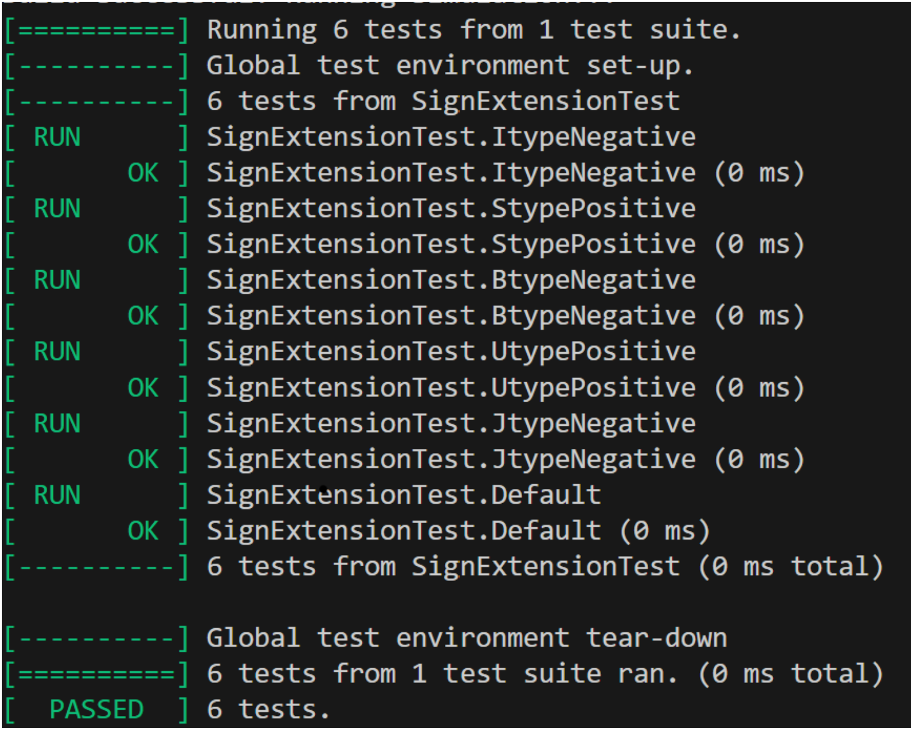

# Contents
- 1 Creating ALU, ALUDecode, Control Unit
	1. ALU
	2. ALUDecode
	3. Control Unit
- 2 Unit Tests on modules for single-cycle RISC-V RV32I Processor
	1. Sign Extend Unit test (complete)
	2. Register File Unit test (complete)
	3. ALU Unit test (complete)
	4. Control Module Unit test (complete)
	5. ALUDecode Unit test (complete)
	6. Data Memory Unit test (complete)
- 3 Debugging Single Cycle Modules
	- ALU
	- Data Memory + Instruction Memory
	- WriteBack Mux
	- 
- 5 Debugging Pipelined Processor
- 6 Testing given assembly programs
	1. Programs 1-3, Addi, BNE, LBU, SB
	2. Program 4  - JALR
	3. PDF testing
	4. verifying PDF on Vbuddy
- 7 Conclusions and Reflections

Things to complete single cycle:
	test all with given programs

# 2. Unit Tests
Unit Tests are a key part of the testing and verification processes, having created Unit Tests for almost every module, it has allowed me to gain a deeper understanding of each of the individual components in the RISC-V processor. Industry standard testbenches were created using G-Test and considering various edge cases and inputs.

### 2.1 Sign Extend Unit Test
The Sign Extend Unit had 5 methods of extension, namely I, S, B, U, J types, examples were hand calculated to verify the correct immediate was being produced.

This is a short snapshot of code (for illustrative purposes - not identical to actual code.) of how the extension module was implemented by another teammate:
```systemverilog
	case(IMMsrc)
    3'b000: out[W-1:0] = {{20{sign}}, instr[W-1:W-12]}; // I-type
```

Below is a snippet of code used to test the default case:

```c++
TEST_F(SignExtensionTest, Default){

    dut->instr = 0x12345678;

    dut->IMMsrc = 0b111; //invalid immsrc

    evaluate();

    EXPECT_EQ(dut->out, 0x12345678); //defaults to just returning instr

}
```

A value of instr is passed in and an invalid IMMsrc code (not specified by the code explicitly) is provided. The testbench checks that the output value is identical to the original instruction. 

An image is shown below verifying that each of the 6 testcases passed, indicating that the intended logic was outputted correctly.



### 2.2 Register File Unit Test

The Register File consists of 1 Write port and simultaneous dual-port read per clock cycle, testing this would need to check that written data was written to the correct address

```C++
 TEST_F(reg32Test, WriteAndReadAnotherRegister) {

     dut->write_addr = 2;         // Write to register 2

     dut->WD3 = 0x12345678; // Data to write

    dut->WE3 = 1;     // Enable write

    evaluate();

    clockTick();

    dut->WE3 = 0;     // Disable write

    dut->A2 = 2;       // Read from register 2

    evaluate();

    clockTick();

    EXPECT_EQ(dut->DOut2, 0x12345678);

}
```

The above code indicates writing the data 0x12345678 to register 2, As the Register File is a clocked component, an additional clockTick signal was devised in order to update the data inside the component, the output Dout2 is expected to receive the data from WD3.

Another important consideration is that the register 0 is a special register which must not be overwritten, there was a separate test devised for this as it is a critical part of the RISC-V architecture functioning correctly.

Below there is code showing the test for ensuring this contraint is respected.

```C++
TEST_F(reg32Test, WriteToRegister0ShouldNotChange) {

    dut->write_addr = 0;         // write to register 0

    dut->WD3 = 0x12345678; // Data

    dut->WE3 = 1;     // eable write

    evaluate();

    clockTick();

    dut->WE3 = 0;     // Disable write

    dut->A1 = 0;       // Read from register 0

    evaluate();

    clockTick();

    EXPECT_EQ(dut->DOut1, 0); // reg 0 should always return 0

}
```

The Register File module successfully passed all 6 testcases that were devised indicating it would function as intended

### 2.3 ALU Unit Test

The ALU is a key part of the RISC-V, it's implementation was discussed in Section 1.1 - ALU. 

The ALU was Unit Tested by keeping in mind the inputs of ALUCtrl and monitoring the output accordingly. 

For example, the XOR instruction was tested by the following unit test: 

```C++
TEST_F(ALUTest, XorInstr) {

    dut->ALUctrl = 0b0100;  // XOR

    dut->SrcA = 0x00000F0F;

    dut->SrcB = 0x00000FF0;

    evaluate();

    EXPECT_EQ(dut->ALUresult, 0x000000FF);  // Expect 0xFF

}
```
The testcase fully tests the behaviour of the XOR operation, and the ALU successfully passed all testcases.

## 2.4 Control Module Unit Test

The Control Unit is perhaps the most influential module within the RISC-V, as it determines each control signal through the datapath, the implementation for this module was discussed in Section 1.3

Many tests were devised to test the functionality of the Control Unit, due to there being many different outputs, this testbench was fairly lengthy, spanning 250 lines of code.

The most important test was for the default case, which determines the outputs of the control unit in case of an invalid instruction. 

```C++
TEST_F(ControlUnitTest, DefaultTest) {

    dut->opcode = 0b1111111;  // invalid opcode

    dut->funct3 = 0b110; //random funct3 - shouldnt affect anything

    evaluate();

    EXPECT_EQ(dut->ALUop, 0b000);  // Expect default for all (0)

    EXPECT_EQ(dut->ALUSrc, 0b0);

    EXPECT_EQ(dut->ResultSrc, 0b00);

    EXPECT_EQ(dut->ImmSrc, 0b00);

    EXPECT_EQ(dut->RegWrite, 0b0);
    
    EXPECT_EQ(dut->MemWrite, 0b0);
    
    EXPECT_EQ(dut->PCSrc, 0b0);


}
```

In case of an invalid instruction, all the outputs are set to 0 ensuring no unexpected operations occur within the processor.

The Control Unit ended up passing all 31 testcases that were designed for it, indicating it was handling logic flow correctly.

## 2.5 ALUDecode Unit Test

The implementation of the ALUDecode module was discussed in Section 1.2. 

Tests for ALUDecode were relatively simple, just ensuring the input of ALUop (defined in Control Unit) and funct3 were correctly mapping to the respective outputs (ALUCtrl signal)

## 2.6 Data Memory Unit Test

In this module, I learnt the limitations of Unit Testing, whilst it is a good way of checking if the expected output matches the actual output for a given input, it may not actually check if the logic implemented is fully accurate for it's purpose!

The original Data Memory did not use Little-endian indexing, at the time of writing the unit tests. I was unaware of this as I hadn't implemented this module initially, therefore the Unit Test written worked for this incorrect `DataMemory.sv` file, but the module wasn't fit for use in the RISC-V - I figured this out later whilst debugging the other modules, which is discussed further in Section 3.


# 3 Debugging Single Cycle Modules

Debugging is an integral part of the design process, and can also be one of the most frustrating too!

Initially, my terminal was filled with over 100 error messages, warnings, undefined behaviour alongside a whole host of other issues. This can seem very daunting and difficult to deal with but I decided to take a systematic approach to tackle it head on.

Errors such as unused signal indicated that the code had some unnecessary clutter with extraneous logic, this seemed relatively easy to debug as it mainly involved removing lines of code.

Errors such as syntax errors were another challenge, which mostly arose from minor oversights from myself and other teammates whilst writing SystemVerilog code. 

A benefit of Unit Testing also quickly became apparent here, every module which I had Unit Tested did not have any syntax errors. These were dealt with beforehand during Unit Testing - once again impressing upon me the importance of testing.

One particular error which I had found very difficult to deal with was a 'circular logic error' this showed that there was some kind of feedback loop being created between modules. I decided to check that data flow of the logic and found that a past implementation of the ALU unit was causing a feedback loop. 

## 3.1 Modifying ALU

It was clear that the ALU needed a few changes in order to prevent circular logic, it seemed that


