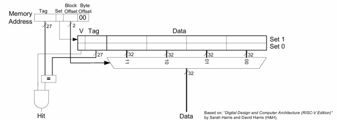
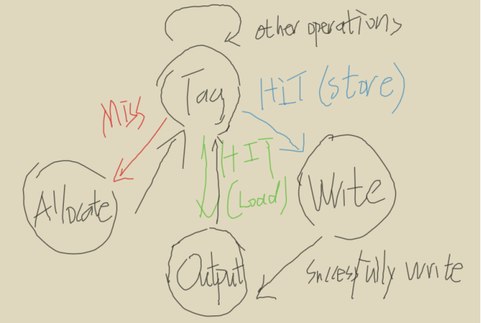
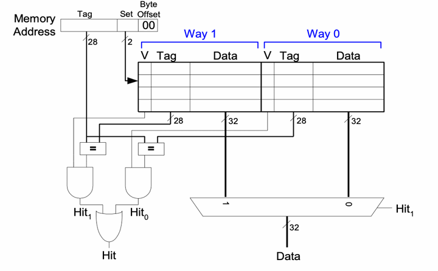

# Contents
- 1 Writing and testing for cache
- 2 PC
# 1. Design for cache
Initial planning of cache
Size ：256 bytes
4 Ways
8 Sets
32 blocks

### 2.1 L1 cache
The initial design of cache only contains L1 cache and L2 cache which stores the recently used data. And we decide to use 4 ways to store the data which stores larger amount of data to avoid the miss condition. but in the case where some data must be replaced it selects the last used way using a shift register. Using 4 ways decrease the miss rate of the instructions, while a set contains more blocks. And we need to use the FSM to control the work of cache. 
### 1.2 The state of L1 cache

The state machine is used, because we need it to implement different operations when there are many conditions of cache. The initial design contains 4 stages: Tag, write, allocate output. The Stage Tag is used to check whether the memory is hit. If not hit, the next stage is allocate, to add the missed data to the cache, then the data will be found in cache if the data is needed. When it is hit, if the instruction is load, the next stage is output, else if the instruction is store, the next stage is write.

On initialization, all Valid bits are set to 0 because the cache starts empty.
When data is loaded into a cache block from main memory, the Valid bit is set to 1.
If the cache block is invalidated, the Valid bit is reset to 0.
On a write operation, the Dirty bit is set to 1 to signify that the block contains modified data.
On a write-back operation to main memory, the Dirty bit is reset to 0.

```C++
case (current_state)
        TAG: begin
            cache_hit = cache_hit_detect(tag, cache_arr[set_index], degree_index);

            if (cpu_data_in.Valid) begin
                if (cache_hit) begin
                    if (cpu_data_in.Wen) begin
                        next_state = WRITE_THROUGH;
                    end else begin
                        next_state = OUTPUT;
                    end
                end else begin
                    degree_index = last_used_shift_reg[DEGREES-1];
                    next_state = ALLOCATE;
                end
            end
        end

        WRITE_THROUGH: begin
            cache_arr[degree_index][set_index].Data[(byte_offset+1)*8-1 -: 8] = cpu_data_in.ByteData;
            next_state = OUTPUT;
        end

        OUTPUT: begin
            cpu_data_out = '{Ready: 1'b1, ByteOut: cache_arr[degree_index][set_index].Data[(byte_offset+1)*8-1 -: 8]};
            update_shift_reg(degree_index, last_used_shift_reg);
            next_state = TAG;
        end

        ALLOCATE: begin
            cache_arr[degree_index][set_index] = '{Valid: 1'b1, Dirty: 1'b0, Tag: tag, Data: 0};
            next_state = TAG;
        end
    endcase
```
### 1.3 Conclusion for 4 ways cache
The L1 cache significantly reduces the time the CPU spends waiting for data and instructions.
By storing frequently accessed data and instructions, the L1 cache allows the CPU to execute operations faster and more efficiently.

### 1.4 The 2-ways cache
However, sometimes the 4-ways cache is less efficient. The additional ways necessitate more complex multiplexing logic to select the correct data block after a hit. So we decide to use 2-ways cache. We no longer need to use State machine.

The new L1 cache use 2 ways and 8 sets.

The input and output logic
```C++
  input logic [31:0] addressIn, 
  input logic [31:0] dataIn,            
  input logic StoreM,                
  input logic LoadM,              
  input logic memwriteM,            
  input logic clk,                    
  input logic [31:0] memIn,              
  output logic [31:0] Dataout, 
  output logic hit                   
```
For input of cache,
we need the The memory address for a read/write operation, Data to be written to the cache during a store operation, Write-enable signal for the cache, Data fetched from main memory when a cache miss occurs, and the clock, Store/Loadm shows the operation.
For output,
Dataout is the data output from the cache to the CPU.
Hit indicates whether the cache operation resulted in a hit or miss

Load operation of 2-way cache
If a load operation (LoadM) is requested
The cache iterate through all ways in the selected set to check if the valid bit is 1 and the tag matches Tag_in. If cache hits it will return the lower byte of the data and set the hit signal to 1.
If no match is found, the hit signal remains 0.
```C++
always_comb begin
    hit = 1'b0;                                            // Default: miss
    Dataout = 32'b0;                                       // Default: no data

    if (LoadM) begin                                       // If load operation
      for (int way = 0; way < DEGREE; way++) begin
        if (valid[set_index][way] && tag[set_index][way] == Tag_in) begin
          Dataout = {{24{1'b0}}, data[set_index][way][7:0]}; // Return lower byte of the data (zero-extended)
          hit = 1'b1;                                      // Cache hit
        end
      end
    end
  end
```
The update of 2-way cache
On a Cache miss during load, select the LRU way using the lru bit for replacement, and then fetch data from main memory (memIn), store it in the selected way.
On a store operation, if StoreM is active and memwriteM is enabled, lru select the way for replacement and lower byte of dataIn is write to the selected block.
The lru bit is toggled whenever a way in the set is accessed or updated, ensuring the least recently used way is replaced on the next miss.

```C++
always_ff @(posedge clk) begin
    // On a cache hit during load, update LRU
    if (LoadM && hit) begin
      lru[set_index] <= !lru[set_index];                   // Toggle LRU for the set
    end

    // On a cache miss during load, fetch data from memory and update cache
    if (LoadM && !hit) begin
      lru[set_index] <= !lru[set_index];                   // Toggle LRU for the set
      way_sel = lru[set_index] ? 1'b0 : 1'b1;              // Select the LRU way for replacement
      valid[set_index][way_sel] <= 1'b1;                   // Mark the line as valid
      tag[set_index][way_sel] <= Tag_in;                 // Update the tag
      data[set_index][way_sel] <= memIn;                   // Load data from memory
    end

    // Handle write operations
    if (memwriteM) begin
      way_sel = lru[set_index] ? 1'b0 : 1'b1;              // Select the LRU way for replacement
      if (StoreM) begin                                    // Store operation
        valid[set_index][way_sel] <= 1'b1;                 // Mark the line as valid
        tag[set_index][way_sel] <= Tag_in;               // Update the tag
        data[set_index][way_sel][7:0] <= dataIn[7:0];      // Write lower byte of the input data
      end
    end
  end
  ```
### 1.5 The conclusion of 2-ways cache
It has lower hardware complexity than fully associative or higher-associativity caches.
The access time	is faster than 4-way cache. It has better performance in most tests.

# 2. PC


```C++
module PCReg #(parameter W = 32)(
    input logic clk,
    input logic rst,
    input logic [W-1: 0] PCN,
    output logic [W-1: 0] PC
);

always_ff@(posedge clk)
    if (rst) PC <= {W{1'b0}};
    else PC <= PCN;

endmodule

```
```C++
module PCSrc_mux #(
    parameter DATA_WIDTH = 32 // Default data width
)(
    input logic [DATA_WIDTH-1:0] PCTarget,  
    input logic            PCSrc,       //2bit to 1bit
    input logic [DATA_WIDTH-1:0] PCPlus4,
    //input logic [DATA_WIDTH-1:0] ALUResult,

    output logic [DATA_WIDTH-1:0] PCN   
);


    always_comb begin
        case (PCSrc)
            1'b0: PCN = PCPlus4;
            1'b1: PCN = PCTarget;
            //2'b11: PCN = ALUResult;         

        default: PCN = PCPlus4;
    endcase
    end

endmodule
```C++